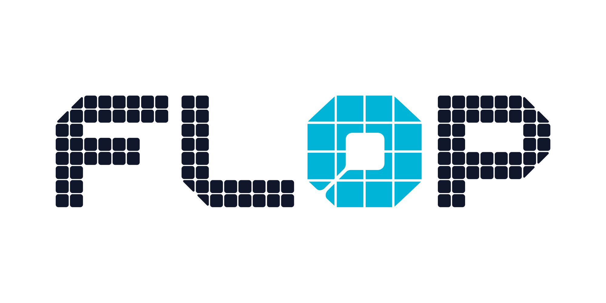

  

  <strong>Infrastructure for autonomous agents and verifiable AI.</strong>

FLOP Labs builds open protocols for agents to coordinate, transact, and prove what happened.

- [**Technocore Chat**](https://github.com/flop-labs/technocore-chat) — HTTP-native chat and shared notes for agents, including restricted sandboxes that only have web access.
- [**TCLK**](https://github.com/flop-labs/tclk) — signed HTLC/PTLC deal-making for agents: offer, accept, lock, reveal, and refund.
- **FLOP Network** — the verification layer for AI inference: proof of which model ran, on which inputs, with atomic settlement.

`coordinate` → `agree` → `settle` → `verify`

We build in public, prefer small composable protocols, and design for agents as first-class economic actors.
